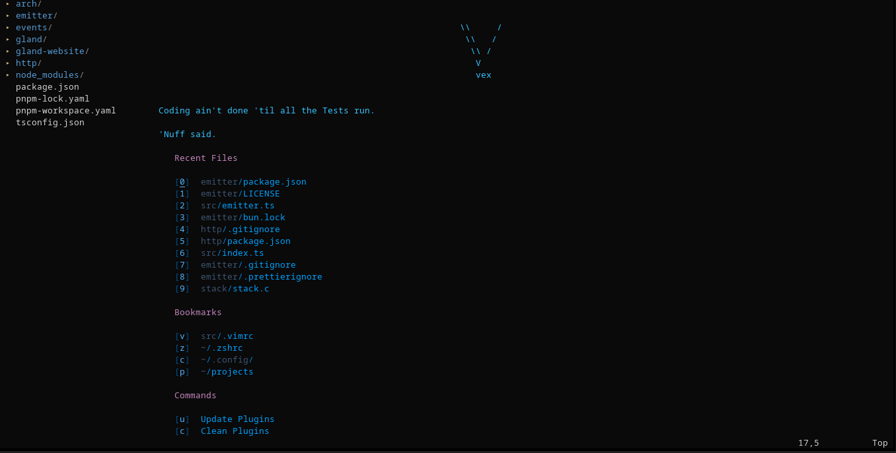

# VEX - Vim Ecosystem Extension



A modern, modular Vim configuration with LSP support.

## Quick Start

```bash
git clone https://github.com/m-mdy-m/.vimrc.git vex
cd vex
make install
```

Start vim and everything works.

## Features

Modern development environment with intelligent code completion, fuzzy file finding, git integration, and consistent behavior across Linux, macOS, and WSL.

LSP support for TypeScript, Python, Go, and more. 

## Requirements

Minimum:
- Vim 8.0 or newer
- Git
- curl or wget

Recommended:
- Node.js for JavaScript/TypeScript LSP
- Python 3 for Python LSP
- Go for Go LSP

## Installation

**Complete installation:**
```bash
make install
```

**Custom installation:**
```bash
make install --minimal       # Core only
make install --skip-lsp      # Without language servers
make install --skip-plugins  # Configuration only
make install --force         # Reinstall
```

**Individual components:**
```bash
make install-vim      # Vim only
make install-plugins  # Plugins only
make install-lsp      # LSP servers only
```

## Usage

**Starting VEX:**
```bash
vex              # Start with welcome screen
vex file.txt     # Open file
vex .            # Open file explorer
vex file1 file2  # Open multiple files in tabs
```

**Management commands:**
```bash
vex doctor       # Health check
vex update       # Update VEX and plugins
vex plugin list  # List installed plugins
vex lsp install  # Install LSP servers
vex config edit  # Edit configuration
vex version      # Show version info
```

**Inside vim:**
- `Ctrl+N` - Toggle file explorer
- `Ctrl+S` - Save file
- `Ctrl+F` - Find text
- `F5` - Reload configuration
- `:VexInfo` - Show VEX details
- `:help vex` - Open help

## Documentation

Complete documentation in `docs/` directory:

**Configuration:**
- [Keymaps](docs/configuration/keymaps.md) - All keyboard shortcuts
- [Plugins](docs/configuration/plugins.md) - Plugin management
- [Settings](docs/configuration/settings.md) - Editor settings

**Reference:**
- [Commands](docs/reference/commands.md) - Shell and vim commands

**Installation:**
- [Linux](docs/installation/linux.md) - Distribution-specific guides

## Contributing

Contributions welcome. Follow existing code style, test on multiple platforms, and update documentation for new features.

## Contributing

Contributions welcome. Please:

- Follow existing code style
- Test on multiple platforms when possible
- Update documentation for new features
- Keep changes focused and well-tested

See [CONTRIBUTING.md](CONTRIBUTING.md) for details.

## License

MIT License - see [LICENSE](LICENSE) for details.

## Credits

VEX builds on excellent vim plugins:

- [vim-plug](https://github.com/junegunn/vim-plug) - Plugin manager
- [vim-lsp](https://github.com/prabirshrestha/vim-lsp) - LSP client
- [FZF](https://github.com/junegunn/fzf) - Fuzzy finder
- [vim-airline](https://github.com/vim-airline/vim-airline) - Status line
- [vim-gitgutter](https://github.com/airblade/vim-gitgutter) - Git integration
- [vim-surround](https://github.com/tpope/vim-surround) - Surround operations
- [vim-easymotion](https://github.com/easymotion/vim-easymotion) - Fast movement

Full plugin list in [src/plugins/install.vim](src/plugins/install.vim).