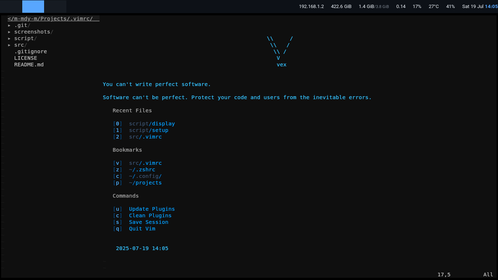

# vex — My Personal Vim Configuration



Welcome to my personal Vim configuration setup! VEX (Vim Ecosystem Extension) is a minimal, Vim setup designed to streamline coding experience. It’s optimized for a clean, dark theme with useful plugins and custom keybindings, making your workflow faster and more intuitive. This configuration is built around my personal needs, but feel free to use or adapt it as you like.

---

## What’s Inside?

- **Plugins**: Handpicked plugins for improved productivity.
- **Settings**: Tweaked Vim settings for optimal coding and editing.
- **Keybindings**: Custom key combinations to save time and reduce effort.

### Quickstart:

```bash
git clone https://github.com/m-mdy-m/.vimrc.git && cd .vimrc && ./script/setup  # Let the magic happen!
```

**What the script does**:

1. Checks/installs Vim
2. Links your `.vimrc` to mine
3. Sets up [vim-plug](https://github.com/junegunn/vim-plug)
4. Installs plugins automatically

---

## Structured Config:

```
├── appearance.vim    # Colors & UI tweaks
├── keys.vim          # Custom shortcuts
├── plugins/install.vim  # Plugin declarations
└── plugins/settings.vim # Plugin configurations
```

## Code Example:

Check out how your code will look with this setup!


## License

This project is licensed under the [MIT](LICENSE)
